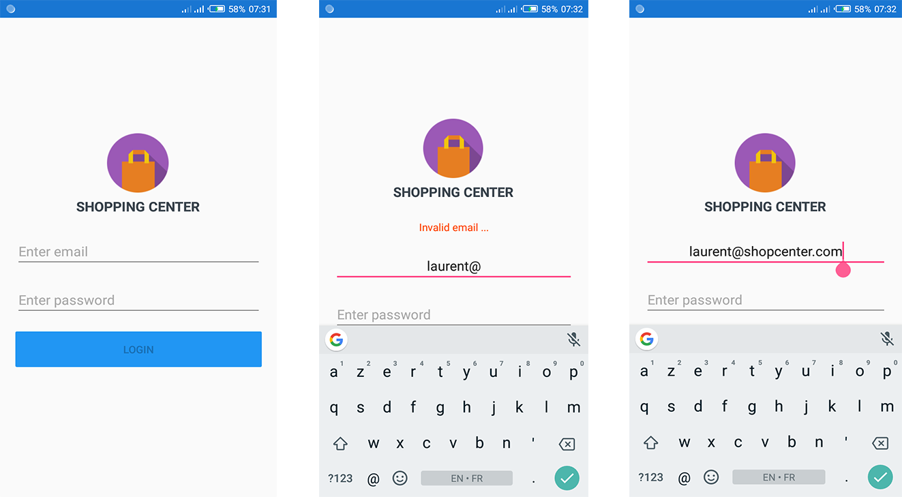
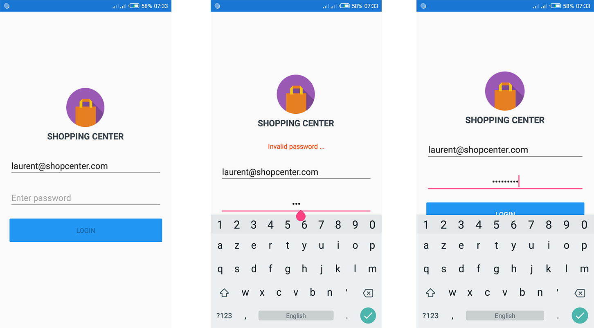
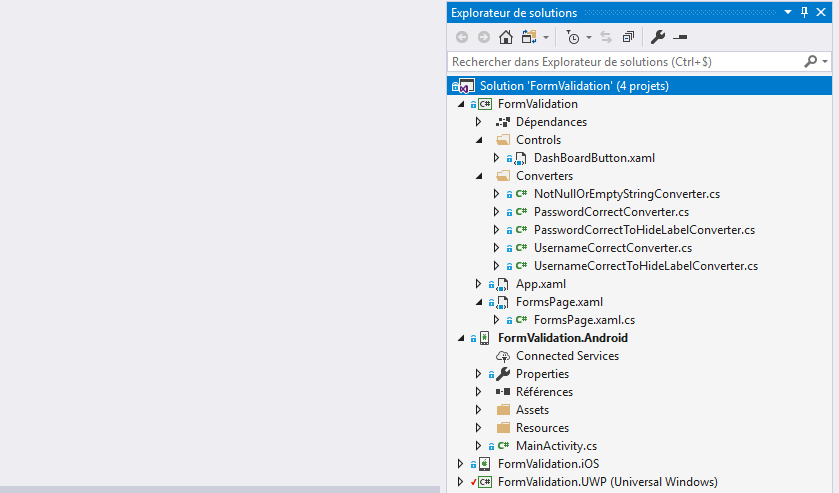

## Real time form validation using Triggers and Converters in Xamarin.Forms

In this Xamarin.Forms project, we want to use **Triggers** and **Converters** to validate in real time login form.







## Create project and select Blank model


## Project structure at the end




## Topic

The goal is to check if  email(user name) and password are correct before enable login button.

- The email must match the following regular expression `^[a-z0-9._-]+@[a-z0-9._-]+\\.[a-z]{2,6}$` 
- The password must have 8 characters at least.
- If email or password is invalid, login button will be disabled and error labels visible. 


## Our converters

- Code for Converter that validate email address and used by trigger to enable login button:

```csharp
using System;
using System.Globalization;
using System.Text.RegularExpressions;
using Xamarin.Forms;

namespace FormValidation.Converters
{
    /// <summary>
    /// Converter that check if username is correct and return true, otherwise return false.
    /// </summary>
    public class UsernameCorrectConverter : IValueConverter
    {
        public object Convert(object value, Type targetType, object parameter, CultureInfo culture)
        {
            return isUserNameCorrect(value);
        }

        public object ConvertBack(object value, Type targetType, object parameter, CultureInfo culture)
        {
            throw new NotImplementedException();
        }

        private bool isUserNameCorrect(object value)
        {
            if (value is string)
            {
                bool isEmail = Regex.IsMatch(
                    (string)value, "^[a-z0-9._-]+@[a-z0-9._-]+\\.[a-z]{2,6}$");

                int length = ((string)value).Trim().Length;

                if (length >= 7 && length <= 60 && isEmail)
                    return true;
                else
                    return false;

            }
            return false;
        }

    }
}

```

- Code for Converter that validate email address and used by trigger to show email error label:

```csharp
using System;
using System.Globalization;
using System.Text.RegularExpressions;
using Xamarin.Forms;

namespace FormValidation.Converters
{
    /// <summary>
    /// Converter that check if username is correct and return true, otherwise return false.
    /// The idea is to be able to show or hide username error label.
    /// </summary>
    public class UsernameCorrectToHideLabelConverter : IValueConverter
    {
        public object Convert(object value, Type targetType, object parameter, CultureInfo culture)
        {
            return isUserNameCorrect(value);
        }

        public object ConvertBack(object value, Type targetType, object parameter, CultureInfo culture)
        {
            throw new NotImplementedException();
        }

        private bool isUserNameCorrect(object value)
        {
            if (value == null || ((string)value).Length == 0)
                return true;

            if (value is string)
            {
                bool isEmail = Regex.IsMatch(
                    (string)value, "^[a-z0-9._-]+@[a-z0-9._-]+\\.[a-z]{2,6}$");

                int length = ((string)value).Trim().Length;
                if (length >= 7 && length <= 60 && isEmail)
                    return true;
                else
                    return false;

            }
            return false;
        }
    }
}

```

- Code for Converter that validate password  and used by trigger to enable login button:

```csharp
using System;
using System.Globalization;
using Xamarin.Forms;

namespace FormValidation.Converters
{
    /// <summary>
    /// Converter that check if passsword is correct and return true, otherwise return false.
    /// </summary>
    public class PasswordCorrectConverter : IValueConverter
    {
        public object Convert(object value, Type targetType, object parameter, CultureInfo culture)
        {
            return isPasswordCorrect(value);
        }

        public object ConvertBack(object value, Type targetType, object parameter, CultureInfo culture)
        {
            throw new NotImplementedException();
        }

        private bool isPasswordCorrect(object value)
        {
            if (value is string)
            {
                int length = ((string)value).Trim().Length;
                if (length >= 8)
                    return true;
                else
                    return false;
            }
            return false;
        }
    }
}
```

- Code for Converter that validate password and used by trigger to show password error label:

```csharp
using System;
using System.Globalization;
using Xamarin.Forms;

namespace FormValidation.Converters
{
    /// <summary>
    /// Converter that check if password is correct and return true, otherwise return false.
    /// The idea is to be able to show or hide password error label.
    /// </summary>
    class PasswordCorrectToHideLabelConverter : IValueConverter
    {
        public object Convert(object value, Type targetType, object parameter, CultureInfo culture)
        {
            return isPasswordCorrect(value);
        }

        public object ConvertBack(object value, Type targetType, object parameter, CultureInfo culture)
        {
            throw new NotImplementedException();
        }

        private bool isPasswordCorrect(object value)
        {
            if (value == null || ((string)value).Length == 0)
                return true;

            if (value is string)
            {
                int length = ((string)value).Trim().Length;
                if (length >= 8)
                    return true;
                else
                    return false;
            }
            return false;
        }
    }
}

```


## Login page

```xaml
<?xml version="1.0" encoding="utf-8" ?>
<ContentPage
    x:Class="FormValidation.FormsPage"
    xmlns="http://xamarin.com/schemas/2014/forms"
    xmlns:x="http://schemas.microsoft.com/winfx/2009/xaml"
    xmlns:controls="clr-namespace:FormValidation.Controls"
    xmlns:converters="clr-namespace:FormValidation.Converters">

    <!--  RESSOURCES  -->
    <ContentPage.Resources>
        <ResourceDictionary>
            <converters:UsernameCorrectConverter x:Key="UsernameCorrectConverter" />
            <converters:UsernameCorrectToHideLabelConverter x:Key="UsernameCorrectToHideLabelConverter" />
            <converters:PasswordCorrectConverter x:Key="PasswordCorrectConverter" />
            <converters:PasswordCorrectToHideLabelConverter x:Key="PasswordCorrectToHideLabelConverter" />
        </ResourceDictionary>
    </ContentPage.Resources>


    <ContentPage.Padding>
        <OnPlatform x:TypeArguments="Thickness" iOS="0, 20, 0, 0" />
    </ContentPage.Padding>


    <StackLayout VerticalOptions="Center">
        <!--  COMPANY LOGO  -->
        <StackLayout HorizontalOptions="Center" VerticalOptions="Center">
            <controls:DashBoardButton
                Margin="0"
                Padding="0"
                HorizontalOptions="Center"
                Icon="Shopping.png"
                Label="SHOPPING CENTER" />
        </StackLayout>

        <!--  FORM CONTAINER  -->
        <StackLayout
            Padding="20"
            Spacing="20"
            VerticalOptions="Center">
            <!--  ERROR LABELS  -->
            <Label
                FontSize="Small"
                HorizontalTextAlignment="Center"
                IsVisible="False"
                Text="Invalid email ..."
                TextColor="OrangeRed">
                <Label.Triggers>
                    <MultiTrigger TargetType="Label">
                        <MultiTrigger.Conditions>
                            <BindingCondition Binding="{Binding Source={x:Reference UserNameEntry}, Path=Text, Converter={StaticResource UsernameCorrectToHideLabelConverter}}" Value="False" />
                        </MultiTrigger.Conditions>
                        <Setter Property="IsVisible" Value="True" />
                    </MultiTrigger>
                </Label.Triggers>
            </Label>
            <Label
                FontSize="Small"
                HorizontalTextAlignment="Center"
                IsVisible="False"
                Text="Invalid password ..."
                TextColor="OrangeRed">
                <Label.Triggers>
                    <MultiTrigger TargetType="Label">
                        <MultiTrigger.Conditions>
                            <BindingCondition Binding="{Binding Source={x:Reference PasswordEntry}, Path=Text, Converter={StaticResource PasswordCorrectToHideLabelConverter}}" Value="False" />
                        </MultiTrigger.Conditions>
                        <Setter Property="IsVisible" Value="True" />
                    </MultiTrigger>
                </Label.Triggers>
            </Label>

            <!--  EMAIL AND PASSWORD ENTRY  -->
            <Entry
                x:Name="UserNameEntry"
                Focused="UserNameEntry_Focused"
                Keyboard="Email"
                MaxLength="60"
                Placeholder="Enter email"
                PlaceholderColor="DarkGray"
                Unfocused="UserNameEntry_Unfocused" />
            <Entry
                x:Name="PasswordEntry"
                Focused="PasswordEntry_Focused"
                IsPassword="True"
                Placeholder="Enter password"
                PlaceholderColor="DarkGray"
                Unfocused="PasswordEntry_Unfocused" />

            <!--  LOGIN BUTTON  -->
            <Button
                x:Name="LoginBt"
                BackgroundColor="#2196F3"
                Clicked="LoginBt_Clicked"
                IsEnabled="False"
                Text="Login"
                TextColor="White">
                <Button.Triggers>
                    <MultiTrigger TargetType="Button">
                        <MultiTrigger.Conditions>
                            <BindingCondition Binding="{Binding Source={x:Reference UserNameEntry}, Path=Text, Converter={StaticResource UsernameCorrectConverter}}" Value="True" />
                            <BindingCondition Binding="{Binding Source={x:Reference PasswordEntry}, Path=Text, Converter={StaticResource PasswordCorrectConverter}}" Value="True" />
                        </MultiTrigger.Conditions>
                        <Setter Property="IsEnabled" Value="True" />
                    </MultiTrigger>
                </Button.Triggers>
            </Button>

            <!--  ACTIVITYINDICATOR: IS RUNNING WHEN CLICK ON LOGIN BUTTON  -->
            <ActivityIndicator
                x:Name="ShowLoginIndicator"
                HorizontalOptions="Center"
                IsRunning="false"
                IsVisible="False"
                VerticalOptions="Center"
                Color="#ea0ea1">
                <ActivityIndicator.Triggers>
                    <MultiTrigger TargetType="ActivityIndicator">
                        <MultiTrigger.Conditions>
                            <BindingCondition Binding="{Binding Source={x:Reference UserNameEntry}, Path=Text, Converter={StaticResource UsernameCorrectConverter}}" Value="True" />
                            <BindingCondition Binding="{Binding Source={x:Reference PasswordEntry}, Path=Text, Converter={StaticResource PasswordCorrectConverter}}" Value="True" />
                        </MultiTrigger.Conditions>
                        <Setter Property="IsVisible" Value="True" />
                    </MultiTrigger>
                </ActivityIndicator.Triggers>
            </ActivityIndicator>

        </StackLayout>
    </StackLayout>
</ContentPage>

```

## Code behind

```csharp
using Xamarin.Forms;


namespace FormValidation
{
    public partial class FormsPage : ContentPage
    {
        public FormsPage()
        {
            InitializeComponent();
            ShowLoginIndicator.IsRunning = false;
        }

        private void LoginBt_Clicked(object sender, System.EventArgs e)
        {
            ShowLoginIndicator.IsVisible = true;
            ShowLoginIndicator.IsRunning = true;
        }

        private void UserNameEntry_Focused(object sender, FocusEventArgs e)
        {
            UserNameEntry.HorizontalTextAlignment = TextAlignment.Center;
        }

        private void UserNameEntry_Unfocused(object sender, FocusEventArgs e)
        {
            UserNameEntry.HorizontalTextAlignment = TextAlignment.Start;
        }

        private void PasswordEntry_Focused(object sender, FocusEventArgs e)
        {
            PasswordEntry.HorizontalTextAlignment = TextAlignment.Center;
        }

        private void PasswordEntry_Unfocused(object sender, FocusEventArgs e)
        {
            PasswordEntry.HorizontalTextAlignment = TextAlignment.Start;
        }
    }
}

```

